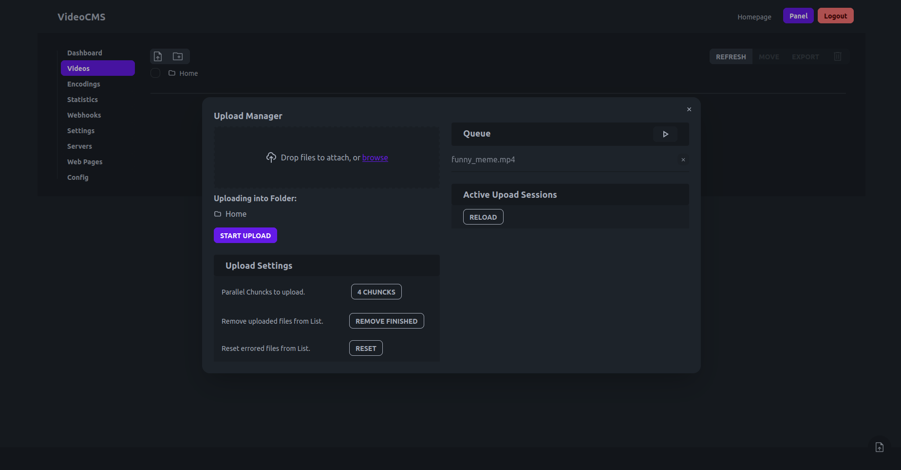
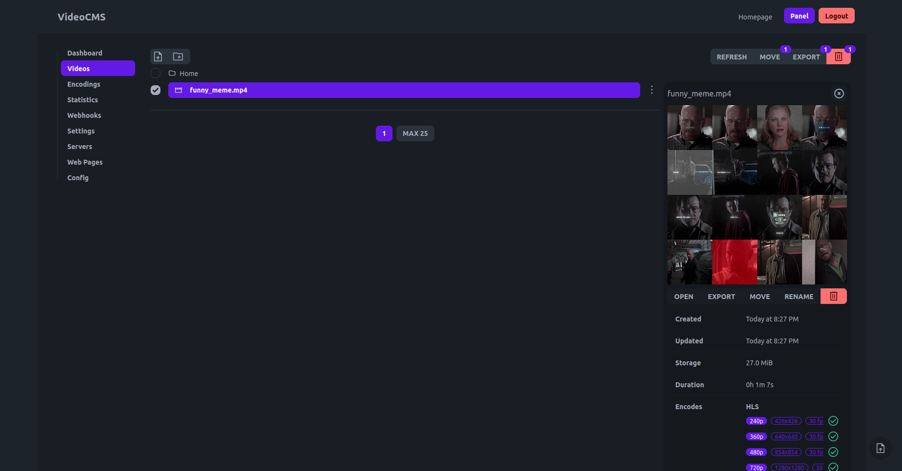

# Get Started

## Prerequisites

Make sure you have the latest [Docker](https://docs.docker.com/engine/install/) installed.

## Setup with a compose file

Create a file named `docker-compose.yaml` with the following content.

```yaml
version: "3.8"
services:
  api:
    image: kirari04/videocms:alpha
    restart: unless-stopped
    ports:
      - "81:3000"
    networks:
      - videocmsnet
    environment:
      - Host=:3000 # [optional] on what port the container exposes the api
      - FolderVideoQualitysPriv=./videos/qualitys # [optional] where the videos are stored inside the container
      - FolderVideoUploadsPriv=./videos/uploads # [optional] where the uploads are stored inside the container
      - StatsDriveName=nvme0n1 # [optional] the drive name where the uploads & videos are stored (for stats on dashboard)
    volumes:
      - ./videos:/app/videos
      - ./database:/app/database
  panel:
    image: kirari04/videocms:panel
    restart: unless-stopped
    ports:
      - "80:3000"
    networks:
      - videocmsnet
    environment:
      - NUXT_PUBLIC_API_URL=http://127.0.0.1:81/api # the url of the api
      - NUXT_PUBLIC_BASE_URL=http://127.0.0.1:81 # the base url of the api server
      - NUXT_PUBLIC_NAME=VideoCMS  # the name of the project
    volumes:
      - ./videos:/app/videos
      - ./database:/app/database
networks:
  videocmsnet:
    driver: bridge
```

Run in the same directory the following command to start the application.

```sh
docker compose up -d
```

## Create User

Currently creating a user is only possible using the cli.

Because of that we have to identify our api container first.
```sh
docker ps
```

**Example**
```sh
docker ps

CONTAINER ID   IMAGE                           COMMAND                  CREATED          STATUS          PORTS                                                                                            NAMES
4a840427cc53   kirari04/videocms:panel         "bun run .output/ser…"   53 seconds ago   Up 52 seconds   0.0.0.0:80->3000/tcp, :::80->3000/tcp                                                            videocms-docs-panel-1
78bfbdec7bc4   kirari04/videocms:alpha         "./main.bin serve:ma…"   53 seconds ago   Up 52 seconds   0.0.0.0:81->3000/tcp, :::81->3000/tcp
```

Copy the container id from the container where the image says `kirari04/videocms:alpha` and run the following command.
```sh
docker exec -it <container-id> /app/main.bin create:user
```

**Example**
```sh
docker exec -it 78bfbdec7bc4 /app/main.bin create:user

Enter Username: root
Enter Password: 
Enter IsAdmin[yes|no]: yes
Created user:  1 root
```

## Modify Settings (Security)

Now you can open the panel on [http://127.0.0.1/login](http://127.0.0.1/login) and login using the account credentials you just created in the previous step.

Next you will have to navigate to the [Config Page](http://127.0.0.1/my/config).

Replace the Values of `JwtSecretKey` and `JwtUploadSecretKey` with a random string that can be up to 512 characters.

Make sure to save the changes using the **save button** at the bottom of the page.

> Make the keys of 32 or longer length so its more difficult to guess.
> You can use a random password generator like the one from [Bitwarden](https://bitwarden.com/password-generator/#password-generator).

After modifying the settings you should restart the contaiers.
```sh
docker compose down
docker compose up -d
```

## Start Sharing Videos

You can now navigate to the [Video Page](http://127.0.0.1/my/videos) and start uploading your first clip by pressing **start upload**.



After the upload has finished you can close the **Upload Manager** and press on the **refresh button**.

The Video will show up in the list and if you click on it you get some more detailed informations.

