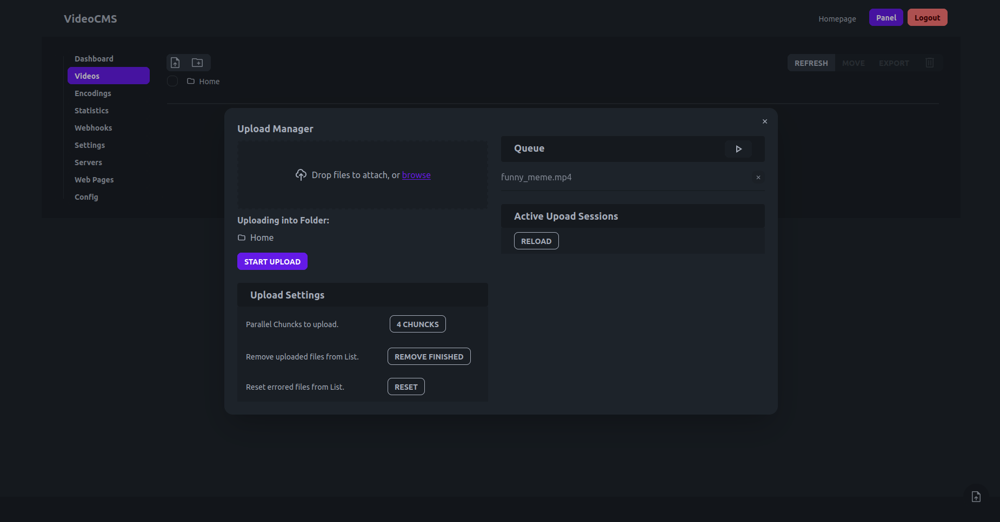
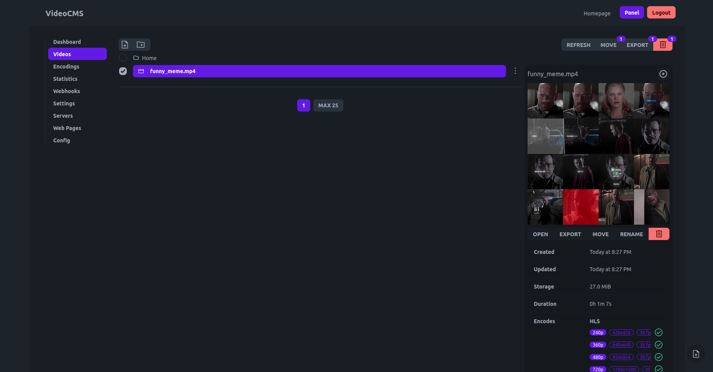

# Get Started

[[toc]]

## Prerequisites

- A server with Docker and Docker Compose installed.
- A registered domain name.
- Point the domains `player.example.com` and `api-player.example.com` to the public IP address of your server.

## Setup

1.  **Create a directory for your VideoCMS installation:**

    ```sh
    mkdir videocms
    cd videocms
    ```

2.  **Create a `docker-compose.yaml` file:**

    Create a file named `docker-compose.yaml` with the following content. This configuration uses Caddy to automatically handle HTTPS for your domains.

    @[code yaml title="docker-compose.yaml"](../../docker-compose.yaml)

3.  **Create a `Caddyfile`:**

    Create a file named `Caddyfile` and replace `player.example.com` and `api-player.example.com` with your actual domains.

    @[code Caddyfile title="Caddyfile"](../../Caddyfile)

4.  **Start the application:**

    Run the following command to start all services.

    ```sh
    docker compose up -d
    ```

## Initial Configuration

On the first startup, a default user with the username `admin` and the password `12345678` is created.

You can now open the panel on `https://player.example.com/login` and login using the default credentials.

Next, navigate to the Config Page at `https://player.example.com/my/config`.

Replace the Value of `BaseUrl` with the URL of your API, which is `https://api-player.example.com`.

Make sure to save the changes using the **save button** at the bottom of the page.

After modifying the settings you should restart the containers.

```sh
docker compose down
docker compose up -d
```

## Start Sharing Videos

You can now navigate to the Video Page at `https://player.example.com/my/videos` and start uploading your first clip by pressing **start upload**.



After the upload has finished you can close the **Upload Manager** and press on the **refresh button**.

The Video will show up in the list and if you click on it you get some more detailed informations.

