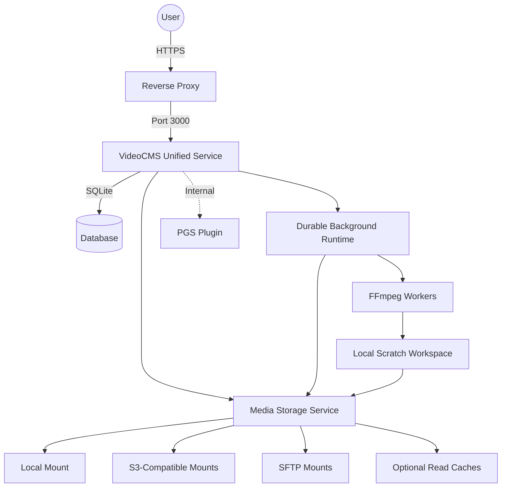

# Architecture

VideoCMS v0.2.x uses a unified Go service for the API, media delivery, and packaged frontend. SQLite stores application state and the durable work queue, while a provider-neutral storage layer keeps media on local disk, S3-compatible storage, or SFTP.

## High-Level Overview



## Service Components

- **HTTP service:** serves the frontend, REST API, player pages, authorized media, resumable uploads, and prepared downloads.
- **SQLite database:** stores users, media metadata, settings, storage topology, delivery statistics, and durable job state.
- **Background runtime:** coordinates task attempts, retries, cancellation, pause checkpoints, queue capacity, schedules, and crash recovery.
- **Storage service:** resolves every file to its authoritative mount and validated object key, then provides range reads, atomic writes, walking, and deletion through a common interface.
- **Scratch workspace:** materializes remote inputs and assembles outputs for tools such as FFmpeg. Scratch data is temporary and is never the authoritative media copy.


## The Transcoding Pipeline

VideoCMS uses a prioritized queue system to handle video processing. This ensures that essential components (like audio and subtitles) are ready before the heavy video encoding begins.

### 1. Upload & Assembly
1.  **Resumable Upload:** The frontend uploads through the embedded tus endpoint at `/api/uploads`. Browser refreshes and network interruptions can resume within the upload retention window.
2.  **Finalize:** After tus reports completion, VideoCMS finalizes the upload and moves the completed raw file from `./videos/uploads/tus/` to `./videos/uploads/{uuid}.tmp`.
3.  **Validation:** `ffprobe` checks the file for valid video streams, resolution (50px - 8000px), and duration.
4.  **Hashing:** A SHA256 hash is generated to detect duplicate files. If a duplicate is found, the new upload acts as a "symlink" to the existing file (Database-level cloning), saving storage space.
5.  **Registration:** The valid file is registered in the database and queued for media processing.

### 2. Durable Job Pipeline

Long-running operations are persisted as jobs containing one or more tasks. Upload import, remote download, encoding, thumbnails, deletion, prepared downloads, storage migration, cache repair, and maintenance all use the same runtime. A restart preserves queued work and recovers interrupted attempts where retrying is safe.

Tasks run through bounded queues:

- `ffmpeg` for encoding, thumbnails, and prepared downloads;
- `network` for remote downloads;
- `storage` for imports, migrations, deletion, and cache repair;
- `maintenance` for cleanup and reconciliation; and
- `audit` for API-key audit records.

For a normal media import, the required source validation and registration work completes before optional processing is scheduled:

1.  **Subtitles (Priority 1):**
    *   Extracts embedded subtitles from the source file.
    *   Converts them to `.vtt` (WebVTT) or `.ass` (Advanced Substation Alpha).
    *   *Note:* Image-based subtitles (PGS) are sent to an external plugin for OCR if enabled.

2.  **Audio (Priority 2):**
    *   Extracts audio tracks.
    *   Converts them to HLS Segmented Audio (`.m3u8` + `.ts` segments).
    *   Stereo, 5.1, and 7.1 layouts are supported.

3.  **Video / Qualities (Priority 3):**
    *   Transcodes the video into the resolutions defined in your settings (1080p, 720p, etc.).
    *   Uses **HLS (HTTP Live Streaming)** with `libx264`.
    *   **Settings:** 4-second segments, Closed GOP, YUV420p.

Users can follow their own work from **Jobs**. Administrators can inspect all jobs, attempts, queues, schedules, and supervised-service health from **Background jobs**.

## Download Preparation Queue

Public downloads are prepared by a separate persistent worker rather than inside the attachment request:

1. The download page posts its quality/container/track manifest and immediately receives a job UUID.
2. SQLite stores the FIFO queue. Identical active or unexpired ready manifests reuse the same job and artifact.
3. A separately limited FFmpeg worker packages HLS video, audio, and subtitle inputs with stream copy (`-c copy`) while persisting progress.
4. The page polls lightweight status responses. Reloading a URL containing `?job=<uuid>` resumes the same view.
5. A completed artifact is atomically moved into `./videos/uploads/download-jobs/` and served with Range support.
6. Cleanup expires artifacts after the configured retention period, removes stale partial/orphan files, and recovers interrupted jobs after restart.

Preparation reads are internal filesystem work and do not count as delivery traffic. Actual response bytes are logged as `download`; HLS/player bytes are logged as `player`. The stats API retains the combined total and adds both source series.

## Storage Structure

Every file record names one authoritative storage mount and a validated object key. Pools decide where new uploads are placed, but changing a pool never moves existing media; migrations perform that work explicitly and switch each video only after its destination copy verifies successfully.

### Local mount layout

The built-in local mount keeps the compatible UUID-based object layout below `FolderVideoQualitysPriv`. Do not manually move or delete authoritative files because database records retain their mount and object keys.

```text
./videos/
├── uploads/                  # Temporary staging area for raw uploads
│   ├── tus/                  # Active tus upload resources and metadata
│   ├── download-jobs/        # Expiring prepared download artifacts
│   └── {file_uuid}.tmp       # Finalized raw video before/while import
├── scratch/                  # Temporary remote inputs and FFmpeg outputs
│
└── qualitys/                 # Built-in local storage mount
    └── {video_uuid}/         # The processed video folder (HLS assets)
        ├── source/           # Authoritative imported source
        ├── {quality_name}/   # e.g., "1080p", "720p"
        │   ├── index.m3u8    # Playlist for this specific quality
        │   ├── segment0.ts   # Video segment 0
        │   └── segment1.ts   # Video segment 1...
        │
        ├── {audio_uuid}/     # Audio Track 1
        │   ├── index.m3u8
        │   └── segment0.ts
        │
        └── {subtitle_uuid}/  # Subtitle Track 1
            └── subtitle.vtt  # The subtitle file
```

S3-compatible and SFTP mounts use the same relative keys below their configured object prefix or remote folder. This keeps media routing independent from provider-specific filesystem behavior.

### Read caches and scratch data

A pool can use one or more mounts as disposable read caches. Playback always has an authoritative primary copy; cache misses and failures fall back to that copy. Cache entries populate on demand, are verified before use, and are evicted by least-recently-used activity and free-space limits.

`StorageScratchDir` is separate from authoritative storage. FFmpeg and other path-based tools materialize remote inputs there and publish completed output trees back through the storage service. Interrupted and expired scratch artifacts are reconciled by maintenance jobs.

### Where is `master.m3u8`?
You won't find a `master.m3u8` file on the disk. VideoCMS generates the Master Playlist **dynamically** on the fly when a user requests it.

This allows the server to:
1.  Instantly enable/disable specific qualities without re-writing files.
2.  Serve different audio tracks based on user language preferences.
3.  Keep media URLs tokenless while the Go server verifies the HttpOnly media cookie set by the player page.

## Database Flow

VideoCMS uses **SQLite** in WAL (Write-Ahead Logging) mode.

*   **`files` table:** Stores metadata about the physical file (Hash, Path, Duration).
*   **`links` table:** Represents the "User's View" of a file. Multiple users can have different `links` pointing to the same `file` (Deduplication).
*   **`qualities`, `audios`, `subtitles`:** Store the status (`Ready`, `Encoding`, `Failed`) of each asset.
*   **`download_jobs`:** Stores public download manifests, queue/progress state, output metadata, and expiry.
*   **`traffic_logs`:** Stores delivered bytes classified as `player` or `download`.
*   **Storage tables:** Store mounts, encrypted provider configuration, pools, primary/cache membership, migration plans, per-video checkpoints, and delayed cleanup state.
*   **Background tables:** Store jobs, tasks, attempts, lifecycle events, queue pause state, schedules, and one-time migration state.
*   **Delivery buckets:** Store batched primary-versus-cache traffic attribution for System Stats. Older buckets expire automatically.

## Scaling Implications

*   **CPU:** FFmpeg is CPU-intensive. `MaxParallelFFmpegTasks` bounds shared FFmpeg work, while operation-specific settings further limit encodes and prepared downloads.
*   **Database:** SQLite and the embedded background runtime are designed for one VideoCMS application instance. Do not run multiple replicas against a database on a network filesystem.
*   **Storage:** Local media stays under the videos volume. S3-compatible or SFTP mounts can expand authoritative capacity, while optional read caches reduce repeated remote reads.
*   **Scratch capacity:** Remote encoding and migration work can temporarily use local scratch space and host bandwidth. Size and monitor `StorageScratchDir` accordingly.
