# Screenshots

## Dashboard
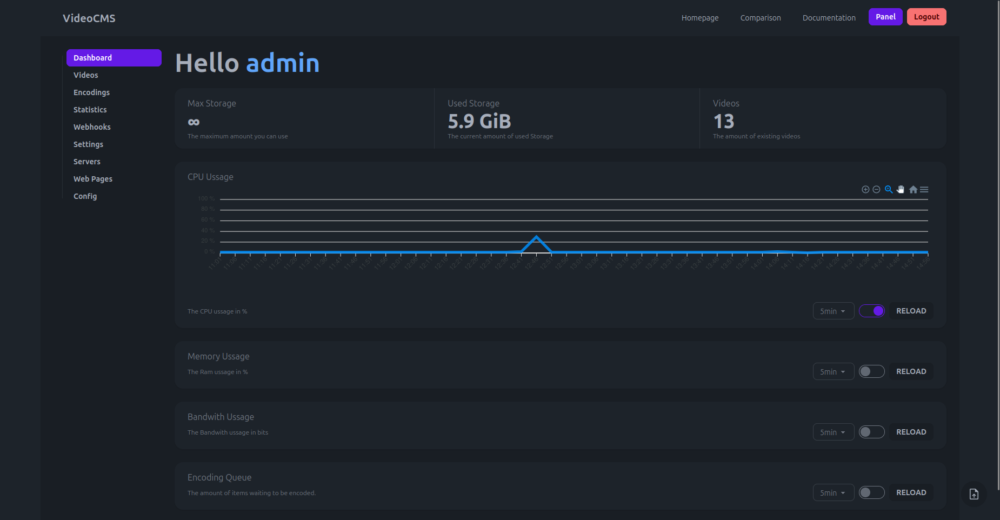

## Video Management
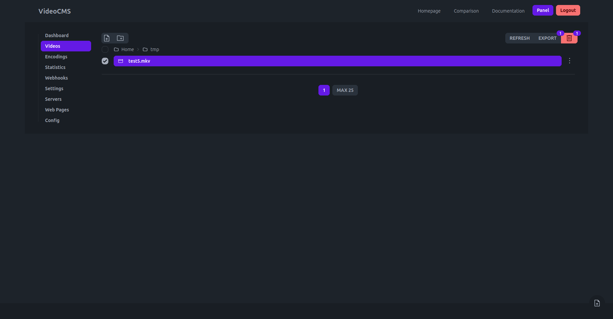
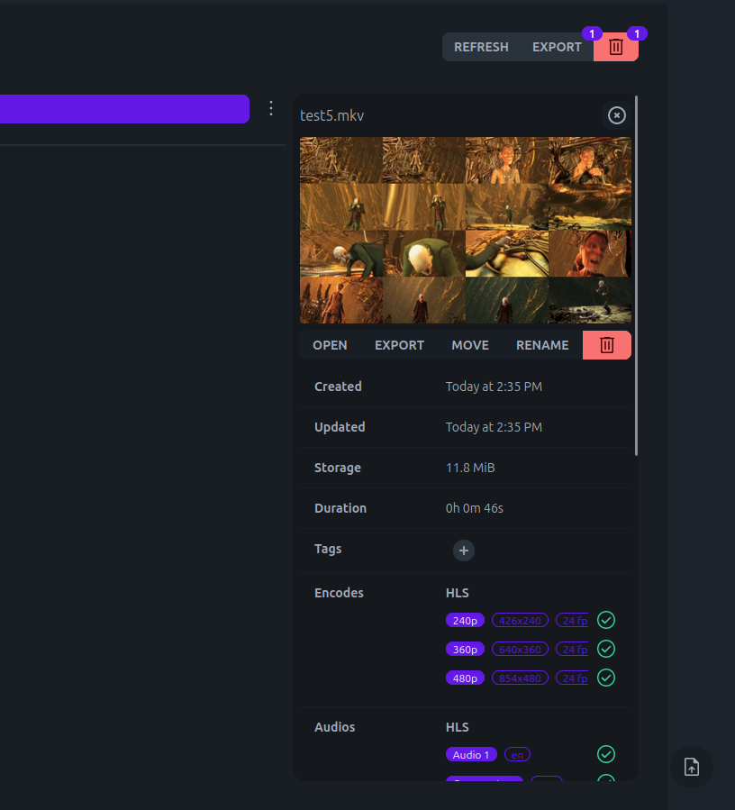
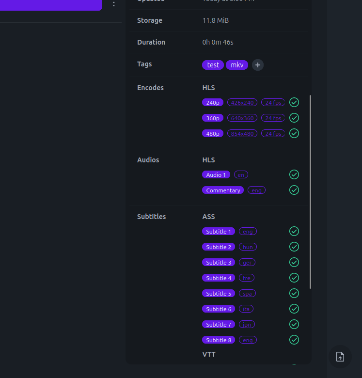

## Video Player
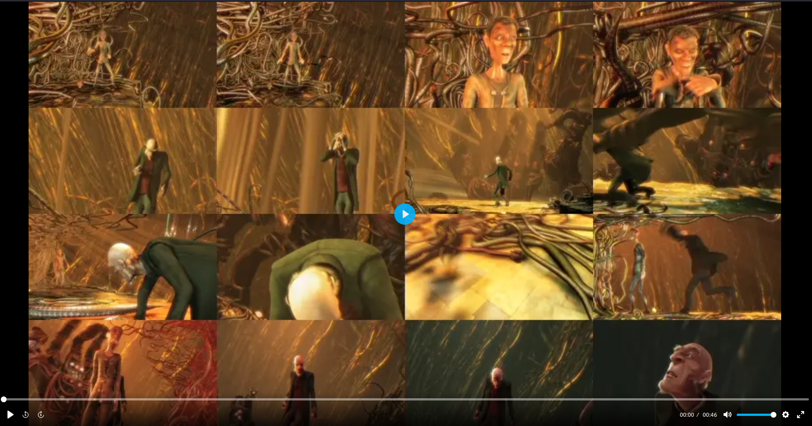
### Settings
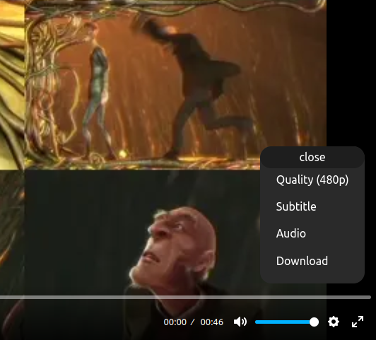
### Quality
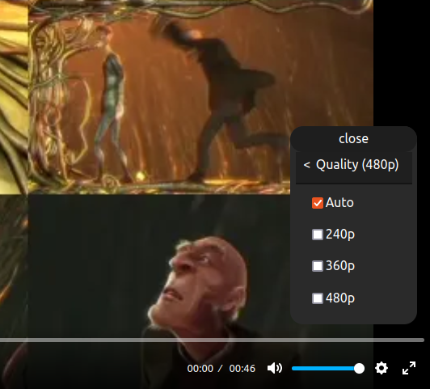
### Subtitles
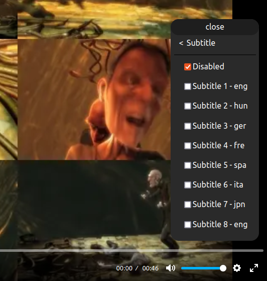
### Audios
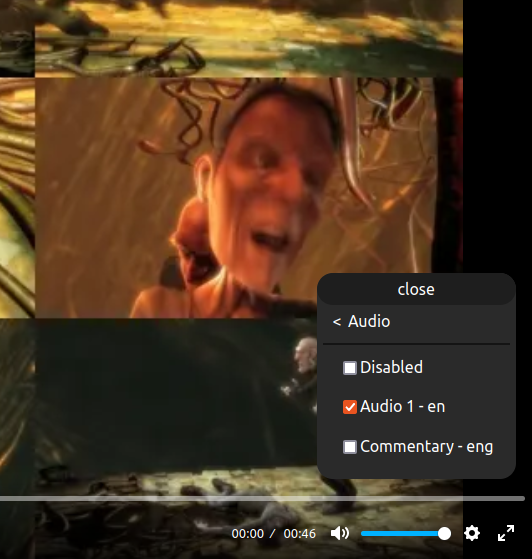
### Download
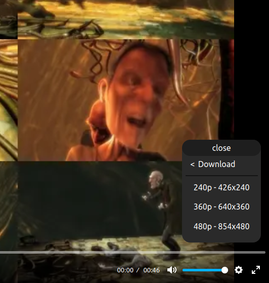

## Export Video
### As a link
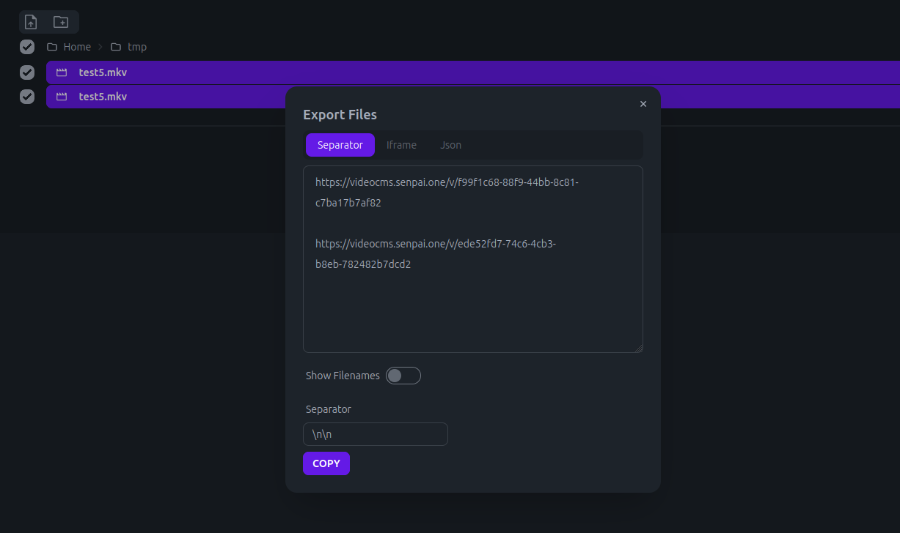
### As a iframe
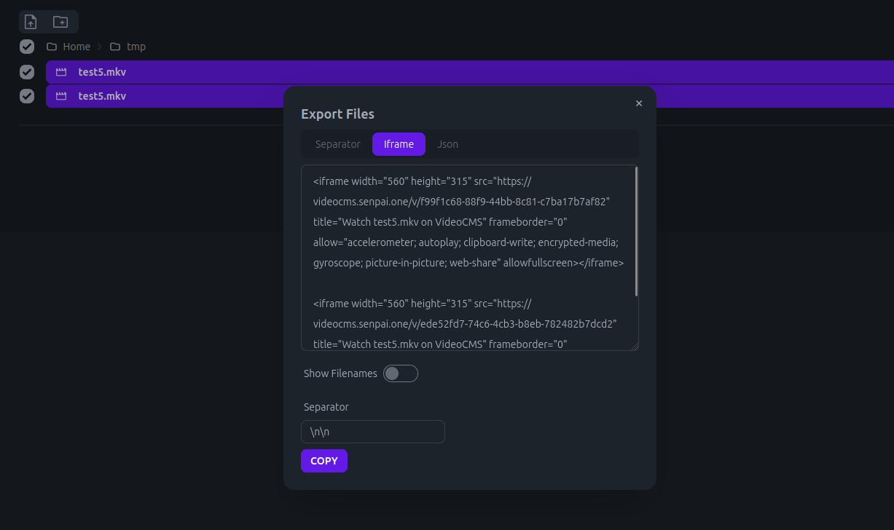
### As JSON
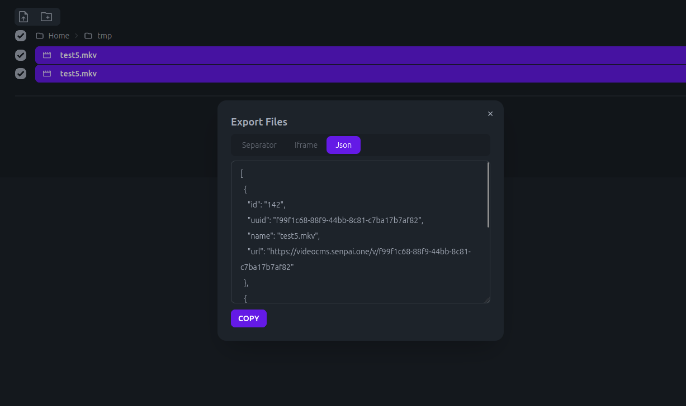

## Encoding Queue
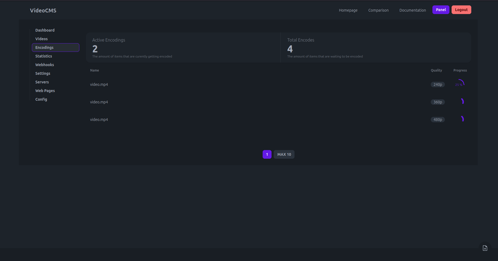

## Webhooks
Webhooks that run on the client and report the viewers position.

## Custom Pages
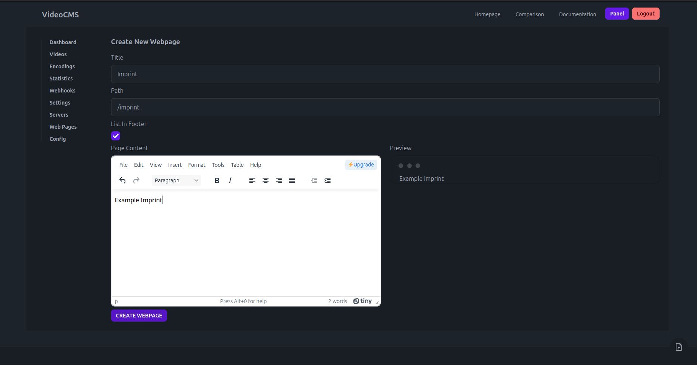
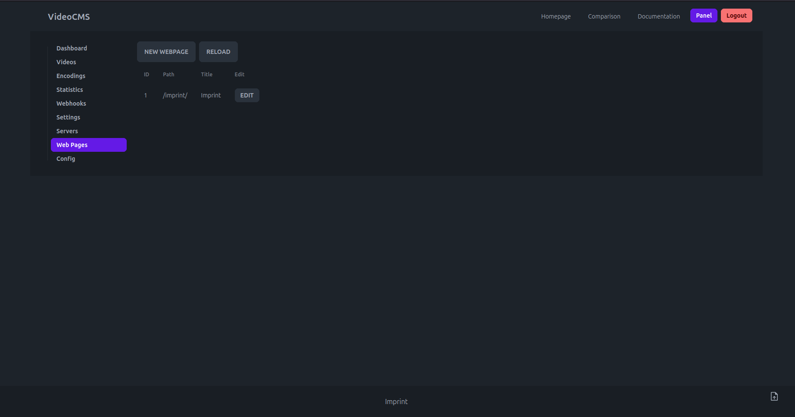
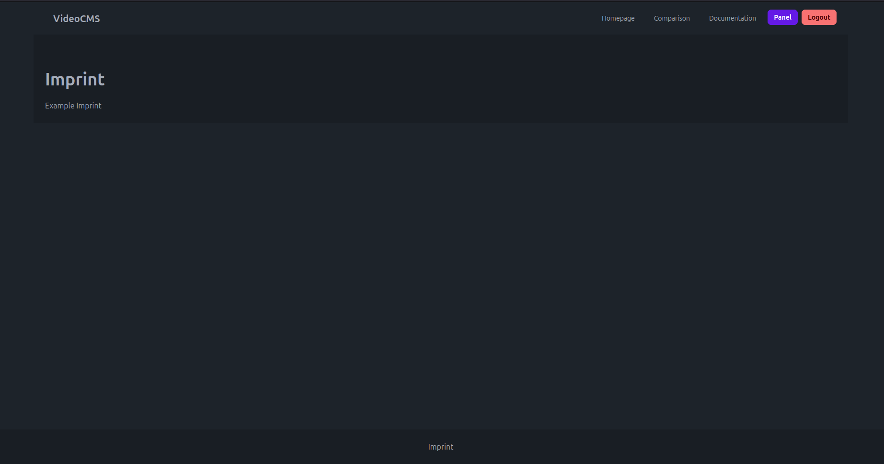

## Config Page
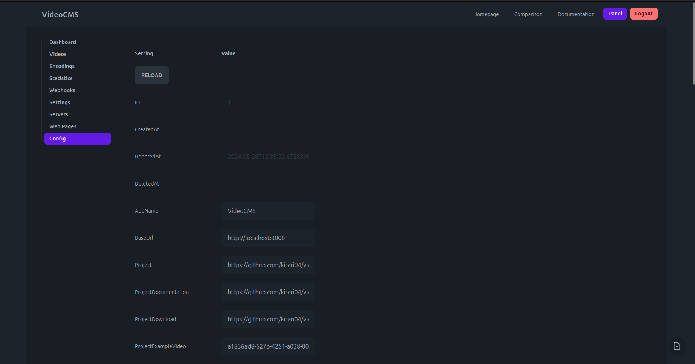