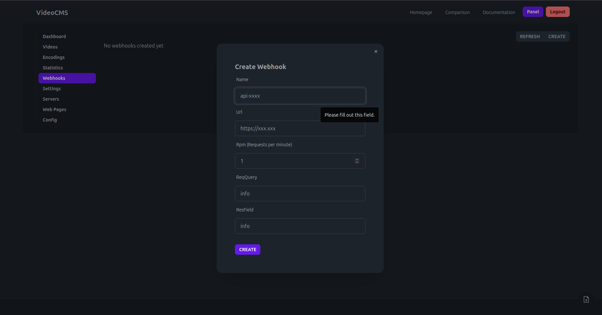

# Screenshots

## Dashboard

## Video Management

## Video Player

### Settings

### Quality

### Subtitles

### Audios

### Download

## Export Video
### As a link

### As a iframe

### As JSON

## Encoding Queue

## Webhooks
Webhooks that run on the client and report the viewers position.

## Custom Pages

## Config Page
